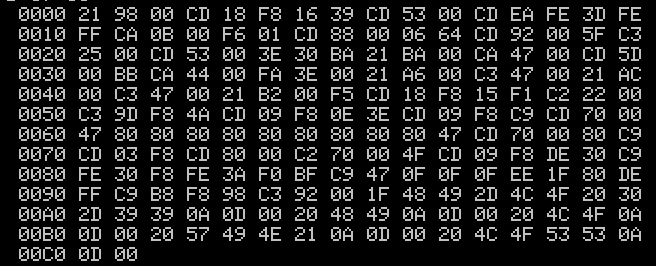
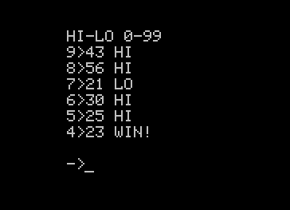

## Игра "Угадай число (HI-LO)" для ПЭВМ Микроша.

### Суть игры

ПЭВМ генерирует случайное число от 0 до 100, которое вам предстоит угадать за девять попыток.
Ввод чисел осуществляется в двухзначном формате (например 05, 12, 83 и тд).
Если введённое число меньше сгенерированного ПЭВМ, то на экране появится LO (недобор), если больше HI (перебор).
Если на экране появилась надпись "WIN", значит вы угадали число, то есть ПОБЕДИЛИ. Если за 9 попыток вы не сможете угадать число, то вы ПРОИГРАЕТЕ и на экране появится "LOSS".

### Запуск

Я намеренно ограничил размер ROM'a до 200 байт, чтобы игру можно было быстро ввести в память ПЭВМ вручную, через директивы системного монитора.
Записывать ROM нужно по 0 адресу. Запуск осуществляется директивой G0. 

 

### Cборка

Инструменты: 

* [zasm](https://k1.spdns.de/Develop/Projects/zasm/Distributions/)
* [bin2tape](https://emu80.org/files/utils/bin2tape_102.zip)
* [GNU make](https://www.gnu.org/software/make/)

Чтобы собрать игру запустите ` make` .

### Хитрости
* Сгенерированное число находится по смещению 
* Количиство попыток можно уменьшить, уменьшив число по смещению 
